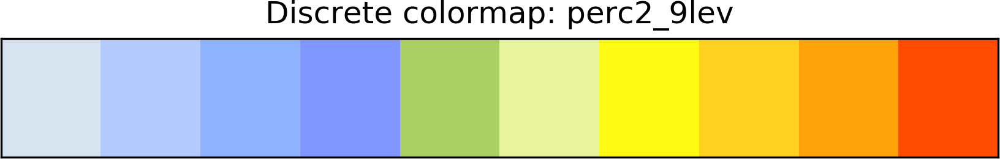
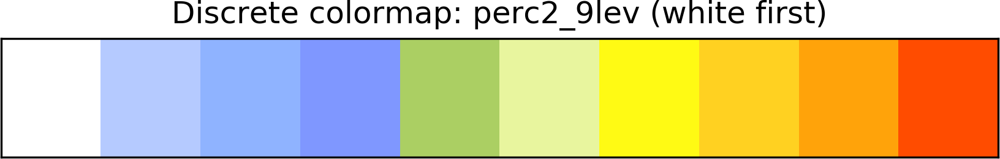
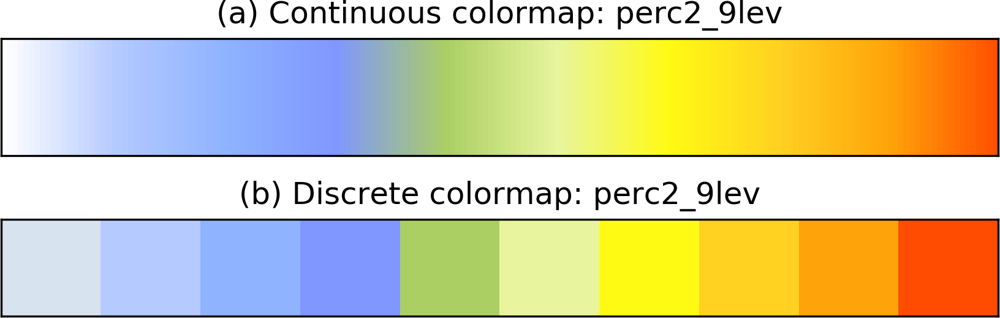

# README
* current directory: Pyton-tools/plot\_tools

### 1. func\_generate\_NCL\_colormaps.py

This script contains the functions that grab the NCL colormap from NCL website, and arrange it into Python colormap format.


- 1.1 To use this function, just call "generate\_NCL\_cmap". Below is an example:


```python
cmap_custom = generate_NCL_cmap('perc2_9lev')
```

This gives you a colormap like following:



- 1.2 It also provides an option to make the first color white. To activate it, use the "white\_first" flag:

```python
cmap_custom_white_first = generate_NCL_cmap('perc2_9lev', white_first=True)
```

This gives you a colormap like following:



- 1.3 It also supports refinement of colormap, which transfer the discrete colormap into "continuous" colormap. To use this function, activate the "cont\_opt" flag with some other parameters:

```python
cmap_custom_cont = generate_NCL_cmap('perc2_9lev', cont_opt=True, cont_param_n=10, cont_param_ws='sRGB')
```

This gives you a colormap like following:




> some notes on the continous parameters:
>
> 1\. cont\_param\_n:  how many transition bands you want to add to the adjacent colors in the raw discreate colormap.
>
> 2\. cont\_param\_ws:  color space in which the interpolation is conducted. Default to "sRGB", which should be OK for most cases. Other options are "HSV", "Lab", "LCHuv", "LCHab", and "XYZ". 
